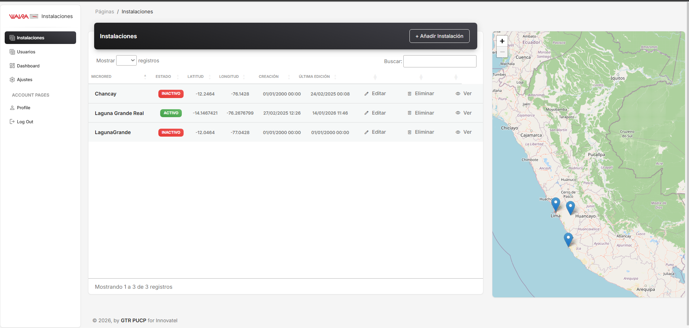
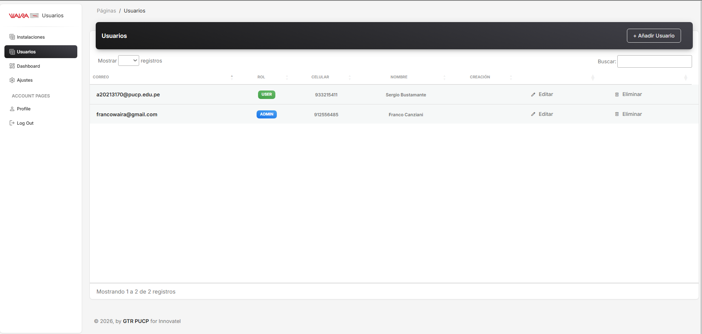
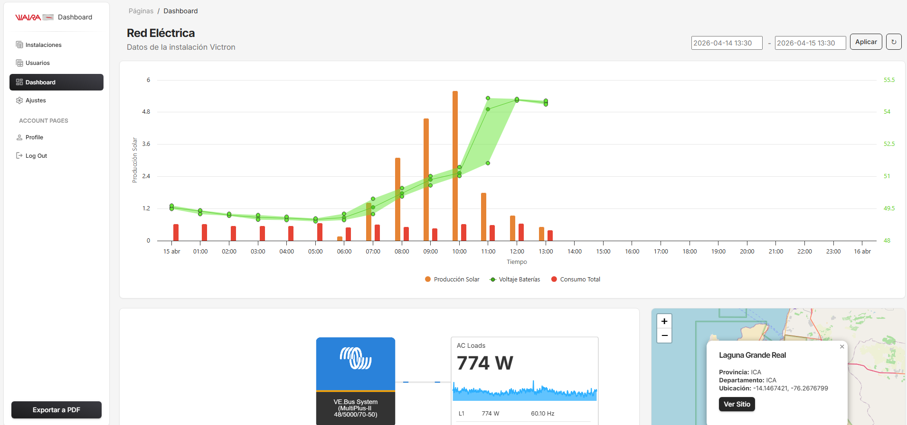
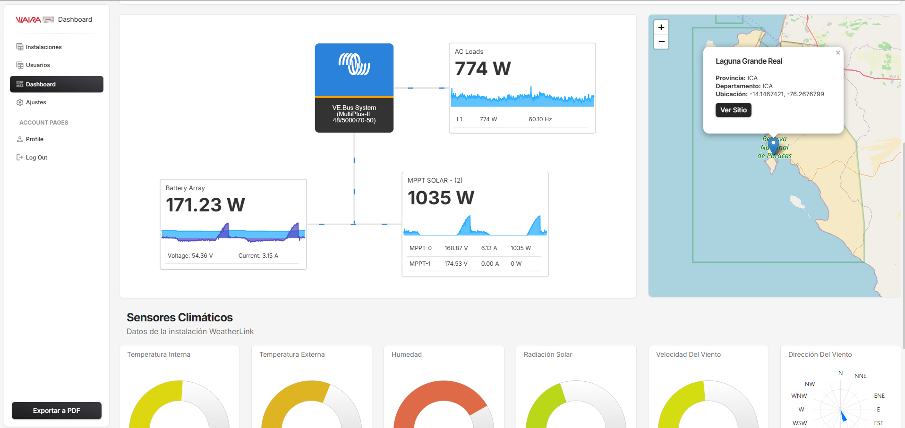
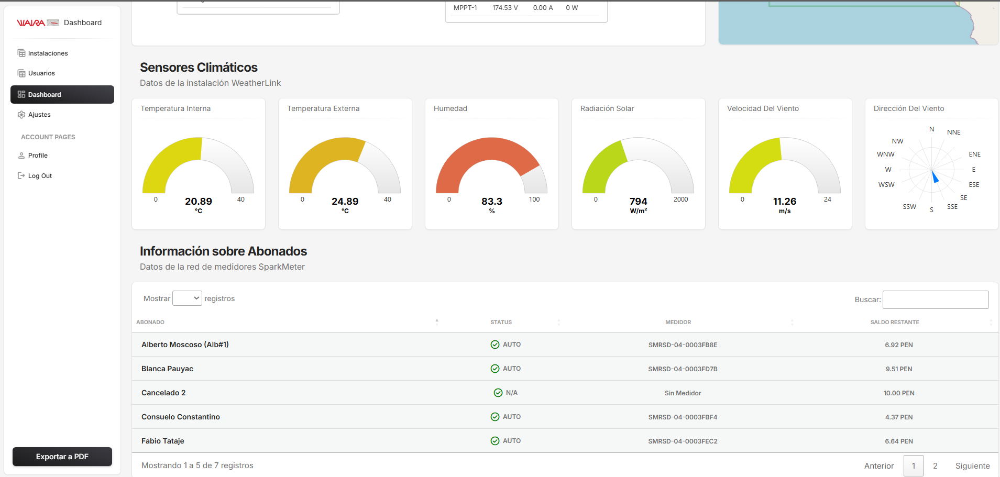

# Dashboard Laguna Grande

## 📌 Descripción
Este proyecto consiste en el desarrollo de un dashboard para la visualización y análisis de datos provenientes de microredes eléctricas. La información es recolectada desde distintas plataformas externas como SparkMeter, Victron y WeatherLink.

## ⚙️ Funcionalidad
- Integración de datos desde APIs externas
- Procesamiento y consolidación de información
- Visualización de métricas relevantes (energía, consumo de luz (S/.), Estado de las baterias, Controlador, etc)
- Generación de reportes para monitoreo

## 🛠️ Tecnologías utilizadas
- **Java & Spring Boot** (backend)
- **APIs REST**
- **HTML / CSS / JS** (frontend)
- **Bases de datos** (MongoDB)

## 🚀 Objetivo
Brindar una herramienta que permita a la empresa monitorear el consumo eléctrico y variables ambientales para la toma de decisiones.

## 📸 Vista del sistema

### Vista de Instalaciones de las Microrredes

### Vista de Usuarios

### Vista del Dashboard de una Microrred

## 📎 Nota
Proyecto desarrollado como trabajo freelance para Waira Energía en colaboración con un equipo reducido.
